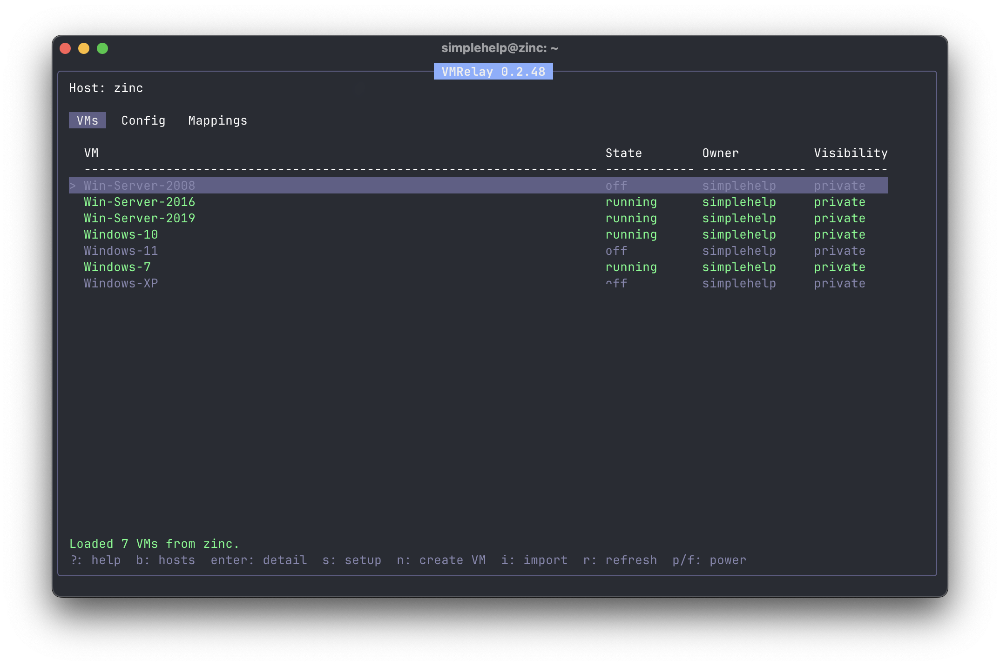

# VMRelay



VMRelay is a terminal UI for managing VMs on a normal remote Linux host. It uses SSH, KVM/libvirt, noVNC, and websockify, but day-to-day use starts with:

```bash
vmrelay
```

VMs run under system libvirt at `qemu:///system`. VMRelay keeps workstation preferences locally, stores lightweight ownership metadata on the VM host, and opens browser consoles through loopback-only noVNC tunnels over SSH.

## Install

```bash
curl -fsSL https://raw.githubusercontent.com/brontoguana/vmrelay/main/install.sh | bash
```

At startup VMRelay checks for newer GitHub releases. Updates and host setup both leave the TUI and restore the terminal first, so local or remote `sudo` prompts work normally.

## Quick Start

1. Run `vmrelay`.
2. Press `a` to add a host, for example `simplehelp@iron.example.com`.
3. Choose whether to run setup after the host is saved.
4. Press `t` to test SSH, libvirt, KVM, noVNC, and websockify.
5. Press `Enter` to open the host.
6. Press `n` to create a VM, or `i` to import one.
7. Open a VM with `Enter` for Summary, Disks, NICs, and Actions.

Common controls:

```text
?          help
m          themes
q/ctrl+c   quit
esc/b      back
up/down    choose
left/right switch tabs or presets
```

## Features

- Host management over SSH with Ubuntu/Debian setup.
- VM create/import workflows with Windows-friendly defaults.
- Browser console access through private noVNC tunnels.
- Disk create/import/convert/detach and boot-priority controls.
- NIC attach/detach against libvirt networks such as `default`.
- VM service mappings from guests back to local workstation ports.
- VM ownership and shared/private metadata for the TUI.
- Background refresh for VM list/detail state.
- Selectable themes.

## Host Setup

Setup installs the virtualization stack needed by VMRelay: QEMU/KVM, libvirt, `virt-install`, `virt-clone`, `qemu-utils`, OVMF/UEFI firmware, `swtpm`, noVNC, websockify, and `socat` as a mapping relay fallback. On modern Ubuntu/Debian it prefers `qemu-system-x86` and falls back to `qemu-kvm` where needed.

Setup also starts/autostarts the libvirt `default` NAT network and creates the VMRelay image pool at `/var/lib/vmrelay/images`.

## VM Creation

New VMs use VMRelay's libvirt defaults:

- qcow2 disks in the VMRelay/libvirt storage pool
- NAT networking
- Windows-compatible `e1000e` NIC
- VNC graphics through noVNC
- USB tablet input
- BIOS or UEFI
- Secure Boot and TPM 2.0 when UEFI is selected
- restart-on-reboot behavior

The create wizard can browse remote ISO files and stage user-home ISOs into libvirt-readable storage when needed.

## VM Import

Press `i` from the host VMs or Config tab. Press `Enter` on Source to browse the remote filesystem.

Supported sources:

```text
.vbox  VirtualBox metadata and disks
.vmx   VMware metadata and disks
.vdi   disk-only import
.vmdk  disk-only import
```

VMRelay reads metadata where available, normalizes imported names, ignores source networking, copies/converts disks to qcow2, and defines a new VM with VMRelay's NAT, VNC, USB tablet, lifecycle, and ownership defaults. Source files are left untouched.

## Service Mappings

Mappings let guests reach local workstation services. A guest connects to the VM endpoint shown in the Mappings tab, normally `192.168.122.1:<vm-port>`. VMRelay forwards that back to `127.0.0.1:<local-service-port>` on your workstation.

The SSH reverse tunnel stays on remote loopback, and the VM-facing relay binds only to the libvirt bridge address.

## Ownership

VMs are system-wide libvirt resources. VMRelay ownership is product metadata for the TUI, stored at `/var/lib/vmrelay/ownership.tsv` when available, with a per-remote-user fallback if the system policy file is unavailable.

Private VMs are intended for owner/admin visibility. Shared VMs are visible to VMRelay users for that host. This is not a hard security boundary if users also have broad host `sudo` or libvirt access outside VMRelay.

## Security

VMRelay does not expose libvirt, noVNC, or websockify directly on the public network. Management transport is SSH. Console listeners are loopback-only and reached through SSH local forwards. VM service mappings expose only a VM-facing relay on the remote libvirt bridge, not the host's public interfaces.

## Paths

```text
~/.config/vmrelay/config.json   local hosts, theme, mappings
~/.local/state/vmrelay          local runtime state
/var/lib/vmrelay/ownership.tsv  remote ownership metadata
```

Disable automatic browser launch:

```bash
VMRELAY_OPEN_BROWSER=0 vmrelay
```
